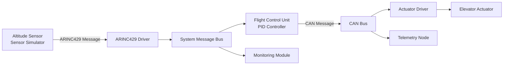

# Embedded Avionics Simulator

## Embedded Avionics Communication Simulator (ARINC429 & CAN)

A modular embedded C simulation of avionics communication and control software.
- Language: C
- Architecture: Modular Embedded System
- Protocols: ARINC429, CAN
- Control: PID Altitude Hold
- Testing: Unit Tests

## System Architecture


## Features

- ARINC429 encoding and decoding

- parity validation

- CAN bus queue simulation

- PID-based altitude hold controller

- modular subsystem structure

- unit tests

## Build

This project can be compiled with a C compiler or Visual Studio C++ compiler.
#### Tests Compilation:
- ARINC tests
````
cl /EHsc /I include src\arinc429.c tests\test_arinc429.c
````
- CAN test
````
cl /EHsc /I include src\can_bus.c tests\test_can.c
````
- Flight control test
````
cl /EHsc /I include src\flight_control.c tests\test_flight_control.c
````

## Tests

Includes tests for:

- ARINC429

- CAN bus

- flight control

## Verification Results

Example simulation output:

```text
Decoded altitude from ARINC429: 1200 ft
Target altitude: 1500.0 ft
Altitude error: 300.0 ft
Actuator elevator command: 81
```
Unit test status:
```text
test_arinc429: PASS
test_can: PASS
test_flight_control: PASS
```
## Future Work

- AFDX (Avionics Ethernet) communication simulation
- ARINC653 partitioning
- RTOS-based task scheduling (QNX / FreeRTOS)
- Extended Kalman Filter navigation

#### Disclaimer
Educational simulator inspired by avionics software architecture, the repo uses DO-178-like practices but not a certified DO-178 artifact. 
  
## Author
**Vasan Iyer**   
Embedded Software / Flight Controls Engineer

Focus areas:
- Embedded C
- Flight controls and flight dynamics
- Avionics protocols: ARINC 429, CAN
- Navigation and control
- PID-based control systems

GitHub: https://github.com/Vaiy108
