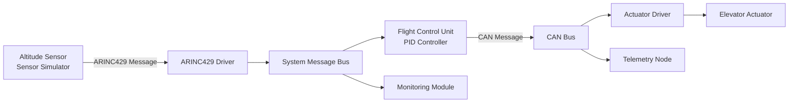

# Embedded Avionics Simulator

A modular embedded C simulation of avionics communication and control software.

## System Architecture

## Features

- ARINC429 encoding and decoding

- parity validation

- CAN bus queue simulation

- PID-based altitude hold controller

- modular subsystem structure

- unit tests

## Build

This project can be compiled with a C compiler or Visual Studio C++ compiler.

## Tests

Includes tests for:

- ARINC429

- CAN bus

- flight control